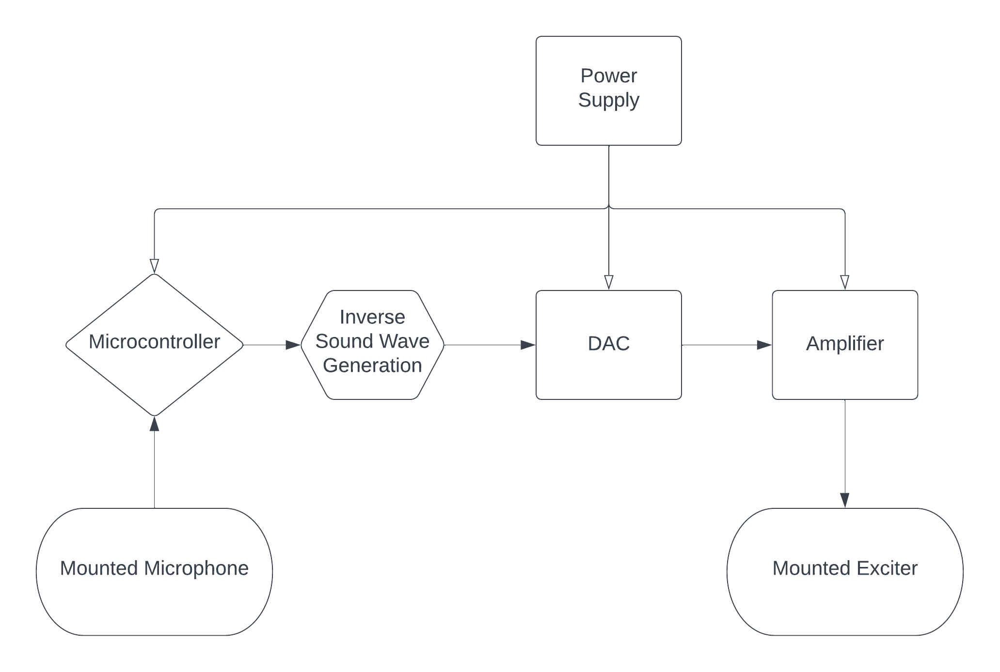

# SoundShieldANC

SoundShieldANC is an innovative noise reduction system designed to minimize unwanted noise entering through windows and other noisy surfaces by utilizing an adaptive noise cancellation algorithm. The system uses strategically placed speakers and microphones to create an optimal sound-reduction performance, providing a more comfortable and quiet environment in various settings.

## Overview

The SoundShieldANC system works by capturing the external noise using microphones mounted on the noisy surfaces (e.g., windows) and generating an inverse sound wave through speakers attached to the same surface. The resulting sound waves cancel out the external noise, reducing the overall sound level entering the space.

## Hardware

The SoundShieldANC system is built using the following hardware components:

- Microcontroller (e.g., ESP32 or Raspberry Pi Pico)
- I2S microphone chip (e.g., Adafruit I2S MEMS Microphone Breakout - SPH0645LM4H)
- Speakers (e.g., small surface transducers or piezoelectric speakers)
- Power supply and wiring

The microcontroller is responsible for processing the audio signals captured by the microphone and generating the appropriate inverse sound wave to be emitted by the speakers. The I2S microphone chip ensures high-quality audio capture, while the speakers produce the necessary sound waves for noise cancellation.

## Software

The software for SoundShieldANC is developed using C++ and runs on the chosen microcontroller. The core of the system is an adaptive noise cancellation algorithm, such as the Least Mean Squares (LMS) or Frequency-Domain Adaptive Filter (FDAF) method. This algorithm adapts to the incoming noise and adjusts the speaker output accordingly, ensuring optimal noise reduction performance.

The software reads audio samples from the I2S microphone, processes them using the adaptive noise cancellation algorithm, and outputs the resulting inverse sound wave to the speakers.

## Patent Claims

The SoundShieldANC system is a novel approach to noise reduction, integrating hardware and software components to deliver efficient and effective noise cancellation. Potential patent claims for the SoundShieldANC system include:

1. The combination of a microcontroller, I2S microphone chip, and speakers for adaptive noise cancellation on noisy surfaces.
2. The specific placement and arrangement of microphones and speakers on the noisy surface for optimal sound-reduction performance.
3. The use of adaptive noise cancellation algorithms, such as LMS or FDAF, to process and cancel out incoming noise in real-time.
4. The integration of the hardware and software components in a compact and easily deployable form factor for use on various surfaces, including windows.

